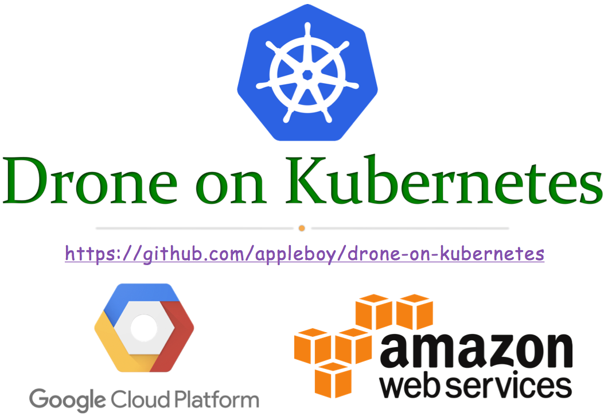

# Drone on Kubernetes

This repository contains example Kubernetes manifests for [Drone][1]. Each subdirectory offers a different environment and set of configurations:

* aws - Scripts and manifests for running [Drone 0.8.x][2] on Amazon Web Services ([EC2][3]).
* gke - Scripts and manifests for running [Drone 0.8.x][2] on Amazon Web Services ([Google Kubernetes Engine][4]).

[1]:https://drone.io/
[2]:http://docs.drone.io/release-0.8.0
[3]:https://aws.amazon.com/ec2
[4]:https://cloud.google.com/kubernetes-engine/
